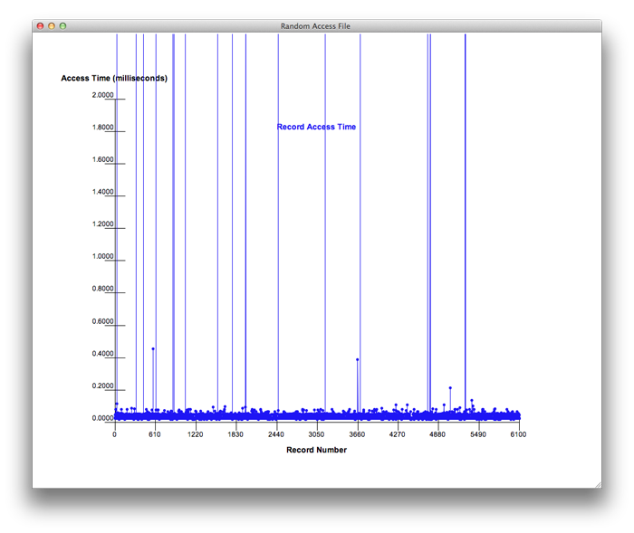

--------------------------------------
B-Trees
--------------------------------------

This chapter covers one of the more important data structures of the last thirty years. B-Trees are primarily used by relational databases to efficiently implement an operation called *join*. B-Trees have other properties that are also useful for databases including ordering of rows within a table, fast delete capability, and sequential access. The chapter begins by introducing some terminology from relational databases to motivate the need for B-Trees. It goes on to introduce the B-Tree data structure and its implementation. By the end of this chapter you should have an understanding of B-Trees, their advantages over other data structures, and you should be able to demonstrate your understanding by implementing a B-Tree that can be used to efficiently process *joins* in relational databases.

Relational Database Tables
---------------------------

You can find the three database tables from the text here.

	* :download:`Feed.tbl<files/Feed.tbl>`
	* :download:`FeedAttribute.tbl<files/FeedAttribute.tbl>`
	* :download:`FeedAttribType.tbl<files/FeedAttribType.tbl>`

The Inefficient Join Program
-----------------------------

The inefficient join program can be :download:`downloaded<files/joinquery.py>` by clicking here.

.. literalinclude:: files/joinquery.py
    :language: python
    :linenos:

B-Tree Implementations
------------------------

B-Trees, like most other tree data structures can be implemented both iteratively and recursively. Both implementations are described in the text and they both have starter shells provided here.

Each implementation includes two main functions. The *btreemain* in each contains a test program. Sample output is included in the file for the *btreemain* function. The other *main* function contains the join query using the B-Tree implementation to construct a B-Tree index over two of the database tables to improve the join efficiency. Comparing either of these queries to the inefficient join program above will illustrate the advantage of a B-Tree over sequential search.

Iterative B-Tree
==================
This shell is provided as an implementation that supports an iterative implementation of insert, delete, and update. The starting shell can be :download:`downloaded <files/joinquerybtree.py>` here. As stated above, the program contains two main functions for testing of the B-Tree implementation. The Stack implementation is required for this program and can be :download:`downloaded <../chap4/files/stack.py>` here. The Queue implementation is required for this program and can be :download:`downloaded <../chap4/files/queue.py>` here. These two files must be placed in the same directory as the database tables and the B-Tree implementation file.

.. literalinclude:: files/joinquerybtree.py
    :language: python
    :linenos:

Recursive B-Tree
=================
This shell is provided as an implementation that supports a recursive implementation of insert, delete, and update. The starting shell can be :download:`downloaded <files/joinquerybtreerecursive.py>` here. As stated above, the program contains two main functions for testing of the B-Tree implementation. The Queue implementation is required for this program and can be :download:`downloaded <../chap4/files/queue.py>` here. This file must be placed in the same directory as the database tables and the B-Tree implementation file.

.. literalinclude:: files/joinquerybtreerecursive.py
    :language: python
    :linenos:

Sample Output from Join
-------------------------

Here we have sample output from the join as output by any of the three join programs above. You can :download:`download <files/joinoutput.txt>` the expected output here.

.. literalinclude:: files/joinoutput.txt
	:language: text
	:linenos:

Figures from Text
---------------------

.. figure:: DairyDatabaseDesign.png

  Dairy Database Entity Relationship Diagram

.. figure:: ldsunreified.png

  A Many to Many Relationship

.. figure:: lds.png

  Logical Data Structure

  Access Time for Randomly Read Records in a File

.. figure:: btree1.png

  A Sample B-Tree

.. figure:: btree2.png

  A Sample B-Tree with Key 10 Deleted

.. figure:: btree3.png

  Inserting 10 into an empty B-Tree

.. figure:: btree4.png

  After Inserting 8, 14, and 12

.. figure:: btree5.png

  After Splitting as a Result of Inserting 12

.. figure:: btree6.png

  After Inserting 18, 2, and 50

.. figure:: btree7.png

  Inserting 15 into the B-Tree Causes Splitting

.. figure:: btree8.png

  After Deleting the Item Containing 14

.. figure:: btree9.png

  After Deleting the Item Containing 50

.. figure:: btree10.png

  After Deleting the Item Containing 8

.. figure:: btree11.png

  After Deleting the Item Containing 12

.. figure:: btree12.png

  After Deleting the item Containing 18
