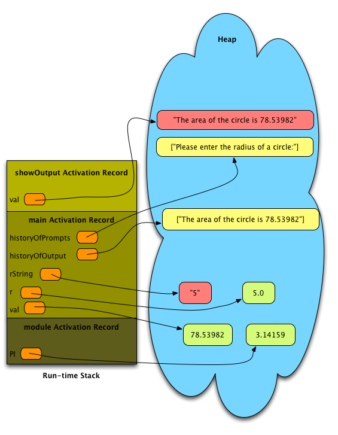
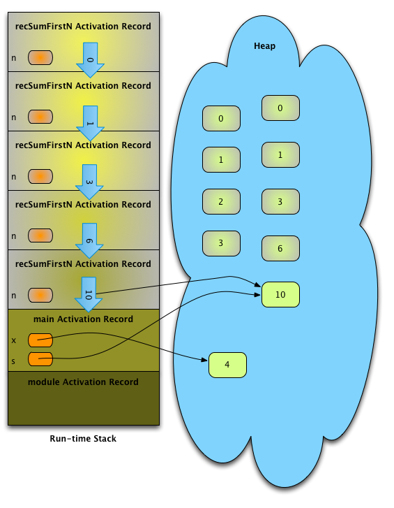
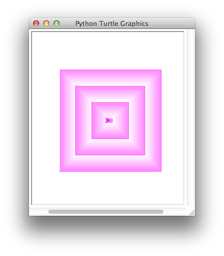

--------------------------------------------------------
Recursion
--------------------------------------------------------

Don't think too hard! That's one of the central themes of this chapter. It's not often that you tell computer programmers not to think too hard, but this is one time when it is appropriate. You need to read this chapter if you have not written recursive functions before. Most computer science students start by learning to program in a style called *imperative* programming. This simply means that you are likely used to thinking about creating variables, storing values, and updating those values as a program proceeds. In this chapter you are going to begin learning a different style of programming called *functional* programming. When you program in the functional style, you think much more about the definition of *what* you are programming than *how* you are going to program it. Some say that writing recursive functions is a *declarative* approach rather than an *imperative* approach. You'll start to learn what that means for you very soon. When you start to get good at writing recursive functions you'll be surprised how easy it can be!

Scope
-------------------------------------

You can :download:`download the program <files/scope.py>` by clicking here.

.. literalinclude:: files/scope.py
	:language: python
	:linenos:

.. _recursivespiral:

Recursive Spiral
------------------

You can :download:`download the program <files/spiral.py>` by clicking here.

.. literalinclude:: files/spiral.py
	:language: python
	:linenos:

Sunflower Program
------------------

You can :download:`download the program <files/sunflower.py>` by clicking here.

This program is not included in the text, but is a good program to look at when starting chapter 3. It illustrates the golden rule and the
fibonacci sequence. Computing fibonacci numbers both recursively and iteratively can lead to a good discussion of computational complexity as well as recursion. You can write a program to time computing fibonacci numbers both recursively and iteratively. The recursive version will not handle numbers bigger than 20 or so. The iterative version can go very high. It is interesting to look at the graph of these two methods of computing fibonacci numbers as a contrast in what is efficient and what is not.

.. literalinclude:: files/sunflower.py
	:language: python
	:linenos:

Figures from Text
-------------------

.. figure:: interpreter.png

  The Python Interpreter

.. figure:: scope.png

  Scopes within a Simple Program

  The Run-time Stack and the Heap

.. figure:: wingruntimestack.png

  The Wing IDE Showing the Run-time Stack

.. figure:: recursiveruntime.png

  The Run-time Stack of a Recursive Function Call

.. figure:: recursivereturn.png

  The First Return from recSumFirstN

  The Last Return from recSumFirstN

  A Spiral Image

.. figure:: tree.png

  A Tree
