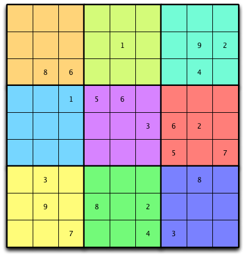
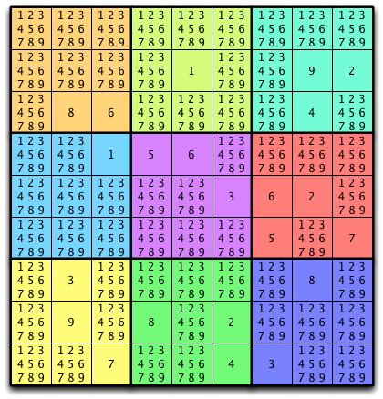

.. _setsmaps:

--------------------------------------
Sets and Maps
--------------------------------------

In the last chapter we studied sequences which are used to keep track of lists of things where duplicate values are allowed. For instance, there can be two sixes in a sequence or list of integers. In this chapter we look at *sets* where duplicate values are not allowed. After examining sets we'll move on to talk about *maps*. *Maps* may also be called *dictionaries* or *hash tables*.

The term *hash table* actually suggests an implementation of a set or map. The primary focus of this chapter is in understanding *hashing*. Hashing is a very important concept in Computer Science because it is a very efficient method of searching for a value. To begin the chapter we'll motivate our interest in hashing, then we'll develop a hashing algorithm for finding values in a set. We'll also apply hashing to the building of sets and maps. Then we'll look at an important technique that uses hashing called *memoization* and we'll apply that technique to a couple of problems.

The HashSet Datatype
----------------------

You can :download:`download <files/hashset.py>` HashSet datatype implementation here. The implementation is partial. The remainder of the set implementation is left as an exercise for the reader.

.. literalinclude:: files/hashset.py
    :language: python
    :linenos:

The HashMap Datatype
---------------------

You can :download:`download <files/hashmap.py>` HashMap datatype implementation here. The implementation is partial. The remainder of the set implementation is left as an exercise for the reader. The HashMap datatype requires a module called hashset.py containing the HashSet datatype.

.. literalinclude:: files/hashmap.py
    :language: python
    :linenos:

Sudoku Puzzles
---------------

Here are six sudoku puzzles that can be solved using the sudoku solver rules that are discussed in this chapter.

	* :download:`sudoku1.txt<files/sudoku1.txt>`
	* :download:`sudoku2.txt<files/sudoku2.txt>`
	* :download:`sudoku3.txt<files/sudoku3.txt>`
	* :download:`sudoku4.txt<files/sudoku4.txt>`
	* :download:`sudoku5.txt<files/sudoku5.txt>`
	* :download:`sudoku6.txt<files/sudoku6.txt>`

Figures from Text
--------------------

  A Sudoku Puzzle

  Annotated Sudoku Puzzle

.. figure:: sudoku-2reduce-once.png

  Sudoku Puzzle After One Pass

+----------------------+------------+-----------------------------+-----------------------------------------------------------------------------------------+
|      Operation       | Complexity |            Usage            |                                       Description                                       |
+======================+============+=============================+=========================================================================================+
| Set Creation         | O(1)       | s=set([iterable])           | Calls the set constructor to create a set. Iterable is an optional initial contents in  |
|                      |            |                             | which case we have O(n) complexity.                                                     |
+----------------------+------------+-----------------------------+-----------------------------------------------------------------------------------------+
| Set Creation         | O(1)       | s=frozenset([iterable])     | Calls the frozenset constructor for immutable set objects to create a frozenset object. |
+----------------------+------------+-----------------------------+-----------------------------------------------------------------------------------------+
| Cardinality          | O(1)       | len(s)                      | The number of elements in *s* is returned.                                              |
+----------------------+------------+-----------------------------+-----------------------------------------------------------------------------------------+
| Membership           | O(1)       | e in s                      | Returns True if *e* is in *s* and False otherwise.                                      |
+----------------------+------------+-----------------------------+-----------------------------------------------------------------------------------------+
| non-Membership       | O(1)       | e not in s                  | Returns True if *e* is not in *s* and False otherwise.                                  |
+----------------------+------------+-----------------------------+-----------------------------------------------------------------------------------------+
| Disjoint             | O(n)       | s.isdisjoint(t)             | Returns True if *s* and *t* share no elements, and False otherwise.                     |
+----------------------+------------+-----------------------------+-----------------------------------------------------------------------------------------+
| Subset               | O(n)       | s.issubset(t)               | Returns True if *s* is a subset of *t*, and False otherwise.                            |
+----------------------+------------+-----------------------------+-----------------------------------------------------------------------------------------+
| Superset             | O(n)       | s.issuperset(t)             | Returns True if *s* is a superset of *t* and False otherwise.                           |
+----------------------+------------+-----------------------------+-----------------------------------------------------------------------------------------+
| Union                | O(n)       | s.union(t)                  | Returns a new set which contains all elements in *s* and *t*.                           |
+----------------------+------------+-----------------------------+-----------------------------------------------------------------------------------------+
| Intersection         | O(n)       | s.intersection(t)           | Returns a new set which contains only the elements in both *s* and *t*.                 |
+----------------------+------------+-----------------------------+-----------------------------------------------------------------------------------------+
| Set Difference       | O(n)       | s.difference(t)             | Returns a new set which contains the elements of *s* that are not in *t*.               |
+----------------------+------------+-----------------------------+-----------------------------------------------------------------------------------------+
| Symmetric Difference | O(n)       | s.symmetric_diff- erence(t) | Returns a new set which contains *s.difference(t).union(t.difference(s))*.              |
+----------------------+------------+-----------------------------+-----------------------------------------------------------------------------------------+
| Set Copy             | O(n)       | s.copy()                    | Returns a shallow copy of *s*.                                                          |
+----------------------+------------+-----------------------------+-----------------------------------------------------------------------------------------+

.. figure:: ../chap1/pixel.png

  Set and Frozen Set Operations

+----------------------+------------+------------------------------------+-----------------------------------------------------------------------------------------------+
|      Operation       | Complexity |               Usage                |                                          Description                                          |
+======================+============+====================================+===============================================================================================+
| Union                | O(n)       | s.update(t)                        | Adds the contents of *t* to *s*.                                                              |
+----------------------+------------+------------------------------------+-----------------------------------------------------------------------------------------------+
| Intersection         | O(n)       | s.intersection_update(t)           | Updates s to contain only the intersection of the elements from *s* and *t*.                  |
+----------------------+------------+------------------------------------+-----------------------------------------------------------------------------------------------+
| Set Difference       | O(n)       | s.difference_update(t)             | Subtracts from *s* the elements of *t*.                                                       |
+----------------------+------------+------------------------------------+-----------------------------------------------------------------------------------------------+
| Symmetric Difference | O(n)       | s.symmetric_diff- erence_update(t) | Updates *s* with the symmetric difference of *s* and *t*.                                     |
+----------------------+------------+------------------------------------+-----------------------------------------------------------------------------------------------+
| Add                  | O(1)       | s.add(e)                           | Add the element *e* to the set *s*.                                                           |
+----------------------+------------+------------------------------------+-----------------------------------------------------------------------------------------------+
| Remove               | O(1)       | s.remove(e)                        | Remove the element *e* from the set *s*. This raises *KeyError* if *e* does not exist in *s*. |
+----------------------+------------+------------------------------------+-----------------------------------------------------------------------------------------------+
| Discard              | O(1)       | s.discard(e)                       | Remove the element *e* if it exists in *s* and ignore it otherwise.                           |
+----------------------+------------+------------------------------------+-----------------------------------------------------------------------------------------------+
| Pop                  | O(1)       | s.pop()                            | Remove an arbitrary element of *s*.                                                           |
+----------------------+------------+------------------------------------+-----------------------------------------------------------------------------------------------+
| Clear                | O(1)       | s.clear()                          | Remove all the elements of *s* leaving the set empty.                                         |
+----------------------+------------+------------------------------------+-----------------------------------------------------------------------------------------------+

.. figure:: ../chap1/pixel.png

  Mutable Set Operations

+-----------------------+------------+---------------------------+----------------------------------------------------------------------------------------------------------------+
|       Operation       | Complexity |           Usage           |                                                  Description                                                   |
+=======================+============+===========================+================================================================================================================+
| Dictionary Creation   | O(1)       | d = {[iterable]}          | Calls the constructor to create a dictionary. Iterable is an optional initial contents in which case it is     |
|                       |            |                           | O(n) complexity.                                                                                               |
+-----------------------+------------+---------------------------+----------------------------------------------------------------------------------------------------------------+
| Size                  | O(1)       | len(d)                    | The number of key/value pairs in the dictionary.                                                               |
+-----------------------+------------+---------------------------+----------------------------------------------------------------------------------------------------------------+
| Membership            | O(1)       | k in d                    | Returns True if *k* is a key in *d* and False otherwise.                                                       |
+-----------------------+------------+---------------------------+----------------------------------------------------------------------------------------------------------------+
| non-Membership        | O(1)       | k not in d                | Returns True if *k* is not a key in *d* and False otherwise.                                                   |
+-----------------------+------------+---------------------------+----------------------------------------------------------------------------------------------------------------+
| Add                   | O(1)       | d[k] = v                  | Adds *(k,v)* as a key/value pair in *d*.                                                                       |
+-----------------------+------------+---------------------------+----------------------------------------------------------------------------------------------------------------+
| Lookup                | O(1)       | d[k]                      | Returns the value associated with the key, *k*. A *KeyError* exception is raised if *k* is not in *d*.         |
+-----------------------+------------+---------------------------+----------------------------------------------------------------------------------------------------------------+
| Lookup                | O(1)       | d.get(k[,default])        | Returns *v* for the key/value pair *(k,v)*. If *k* is not in *d* returns *default* or *None* if not specified. |
+-----------------------+------------+---------------------------+----------------------------------------------------------------------------------------------------------------+
| Remove Key/Value Pair | O(1)       | del d[k]                  | Removes the *(k,v)* key value pair from *d*. Raises *KeyError* if *k* is not in *d*.                           |
+-----------------------+------------+---------------------------+----------------------------------------------------------------------------------------------------------------+
| Items                 | O(1)       | d.items()                 | Returns a view of the key/value pairs in *d*. The view updates as *d* changes.                                 |
+-----------------------+------------+---------------------------+----------------------------------------------------------------------------------------------------------------+
| Keys                  | O(1)       | d.keys()                  | Returns a view of the keys in *d*. The view updates as *d* changes.                                            |
+-----------------------+------------+---------------------------+----------------------------------------------------------------------------------------------------------------+
| Values                | O(1)       | d.values()                | Returns a view of the values in *d*. The view updates as *d* changes.                                          |
+-----------------------+------------+---------------------------+----------------------------------------------------------------------------------------------------------------+
| Pop                   | O(1)       | d.pop(k)                  | Returns the value associated with key *k* and deletes the item. Raises *KeyError* if *k* is not in *d*.        |
+-----------------------+------------+---------------------------+----------------------------------------------------------------------------------------------------------------+
| Pop Item              | O(1)       | d.popitem()               | Return an abritrary key/value pair, *(k,v)*, from *d*.                                                         |
+-----------------------+------------+---------------------------+----------------------------------------------------------------------------------------------------------------+
| Set Default           | O(1)       | d.setdefault(k[,default]) | Sets *k* as a key in *d* and maps *k* to *default* or *None* if not specified.                                 |
+-----------------------+------------+---------------------------+----------------------------------------------------------------------------------------------------------------+
| Update                | O(n)       | d.update(e)               | Updates the dictionary, *d*, with the contents of dictionary *e*.                                              |
+-----------------------+------------+---------------------------+----------------------------------------------------------------------------------------------------------------+
| Clear                 | O(1)       | d.clear()                 | Removes all key/value pairs from *d*.                                                                          |
+-----------------------+------------+---------------------------+----------------------------------------------------------------------------------------------------------------+
| Dictionary Copy       | O(n)       | d.copy()                  | Returns a shallow copy of *d*.                                                                                 |
+-----------------------+------------+---------------------------+----------------------------------------------------------------------------------------------------------------+

.. figure:: ../chap1/pixel.png

  Dictionary Operations

.. figure:: fib.png

  Computing fib(5)
